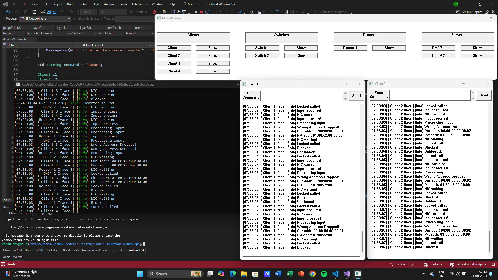
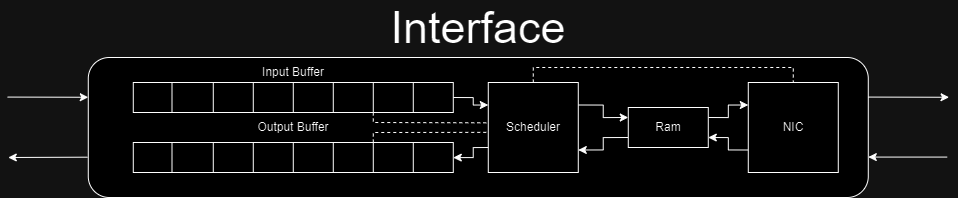
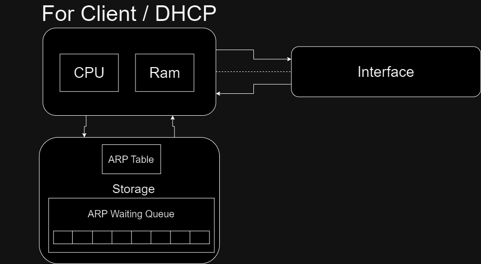
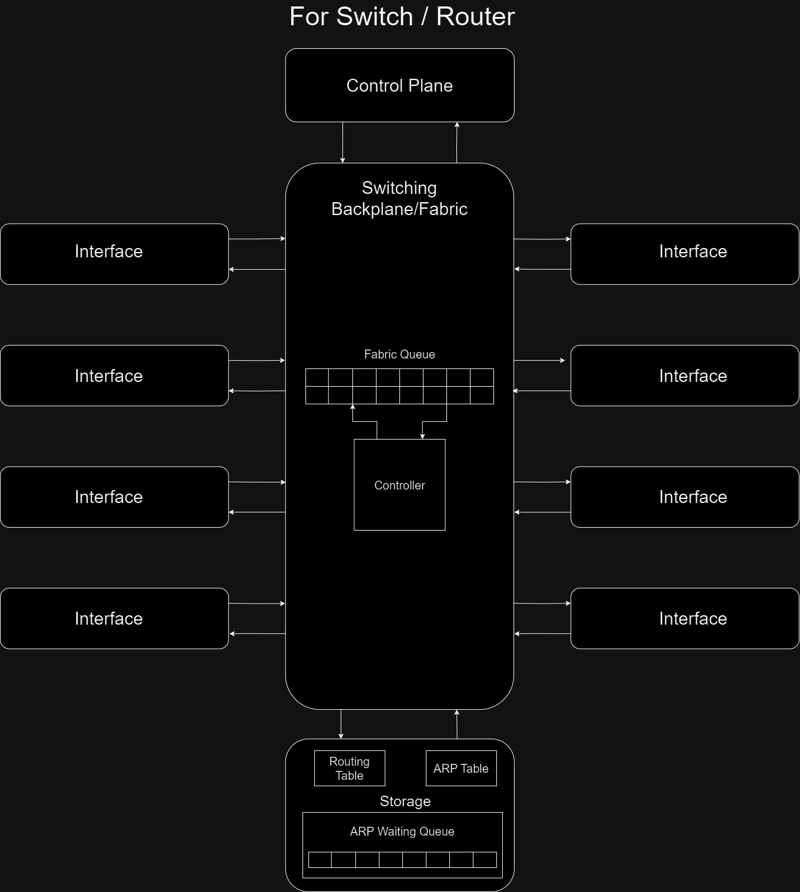

# Cisco Packet Tracer Prototype: Concurrent C++ Network Architecture & Protocol Simulator

[](https://en.cppreference.com/w/cpp/20)
[]()
[](LICENSE)

A high-performance, multi-threaded C++20 network device and protocol simulation engine. **Cisco Packet Tracer Prototype** models low-level hardware abstractions including Network Interface Cards (NICs), FIFO interface buffers, hardware schedulers, control/data plane segregation, and stateful networking protocols.



---

## Technical Highlights

- **Low-Level Hardware Modeling**: Simulates memory buffers, interface packet schedulers, RAM vectors, and internal switch fabrics rather than relying on simple message-passing abstractions.
- **Concurrent Execution Engine**: Powered by custom thread-safe circular queues (`tscircularqueue` and `tscircularptrqueue`) for lock-managed inter-device and inter-interface packet queuing.
- **Native Wireshark PCAP Export**: Built-in `.pcap` packet capture module exports simulated frame data for deep packet inspection.
- **Interactive Cisco-Style CLI**: Emulates real-world network operating systems with diagnostic and configuration CLI commands.

---

## Supported Protocols & Features

| Layer | Protocol / Feature | Description |
| :--- | :--- | :--- |
| **Layer 2 (Data Link)** | **STP (802.1D)** | Spanning Tree Protocol convergence with BPDU processing & timer management |
| **Layer 2 (Data Link)** | **Ethernet 802.3** | Frame dissection, MAC learning, and MAC address table lookup engine |
| **Layer 3 (Network)** | **ARP** | Address Resolution Protocol caching, request/reply, and pending packet queues |
| **Layer 3 (Network)** | **ICMP** | Echo Request / Reply Ping functionality |
| **Layer 3 / 7** | **DHCP** | Full DORA state machine (Discover, Offer, Request, Acknowledge) |
| **Tooling** | **PCAP Exporter** | Live traffic logging compatible with Wireshark analysis |

---

## Device Architectures

### 1. Interface Hardware Architecture
Simulates packet flow between buffers, hardware schedulers, and NIC modules:
- FIFO input/output buffers process packets via dedicated schedulers.
- Schedulers prioritize input queues, staging frame data into simulated device RAM.
- NIC parser verifies CRC and dissects frame headers before dispatching to CPU/Control Plane or Forwarding Plane.



### 2. Host / DHCP Server Architecture
- ARP cache tables are tightly coupled with an ARP Waiting Queue to buffer outbound frames awaiting L2 address resolution.
- DHCP engine manages lease timers, address pools, and configuration state machines.



### 3. Switch & Router Architecture
- L2 Switches utilize shared MAC lookup tables and dispatch control packets (STP BPDUs) directly to the CPU module.
- L3 Routers consult IP Routing Tables, trigger ARP requests on miss, and route frames across internal fabric queues to designated egress interfaces.



---

## CLI Command Reference

### Diagnostics & Interfaces
```bash
ipconfig                    # Display interface IP, Subnet Mask, and Gateway
ipconfig /renew             # Initiate DHCP DORA handshake for address renewal
ping <ip>                   # Send ICMP Echo Request to target IP address
arp <ip>                    # Broadcast ARP request for specified IP address
hostname <name>             # Update device hostname
```

### Table & State Inspection
```bash
show mac address-table      # Display Layer 2 MAC address lookup table
show ip route               # Display Layer 3 IP routing table entries
show ip arp                 # Display active ARP cache resolution entries
show spanning-tree          # Display STP port roles, bridge IDs, and state
```

### Protocol Configuration
```bash
stp timer forward-delay time <sec>   # Configure STP Forward Delay timer
stp timer hello time <sec>           # Configure STP Hello BPDU interval
stp timer max-age time <sec>         # Configure STP Max Age timer
```
## Getting Started
### Prerequisites
- Windows OS (Win32 API GUI)
- C++20 compatible compiler (MSVC / Visual Studio 2022 recommended)
- Python 3.x (for workspace generation)
### Build Instructions
```bash
# Clone the repository
git clone https://github.com/gh0stfreak/Cisco-Packet-Tracer-Prototype.git
cd Cisco-Packet-Tracer-Prototype

# Run setup script to generate project files
python init.py
```
Open the generated solution file (`networkWindowApi.sln`) in Visual Studio and build target `Release` or `Debug`.

Future Roadmap
- Cross-Platform GUI: Refactor Win32 API views to Qt / GLFW for Linux & macOS support.
- Transport Layer: Implement stateful TCP connection handshakes and windowing.
- VLAN Tagging (802.1Q): Add virtual LAN segmentation across Layer 2 switch ports.
- Dynamic Routing: Implement distance-vector (RIP) or link-state (OSPF) routing protocols.

## License
Distributed under the MIT License. See  `LICENSE` for details.
