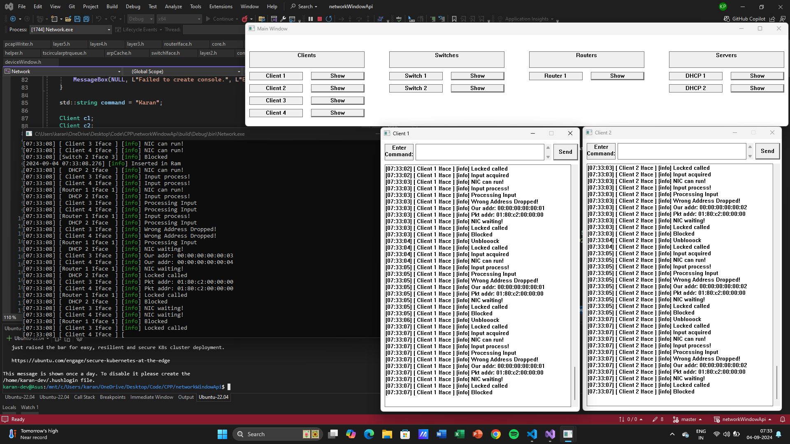

<h1 align="center">Cisco Packet Tracer Prototype</h1>



<!-- <div align="center">
  <h3>
    <a href="https://gh0stfreak.github.io/Blogr-landing-page-main/" color="white" target="_blank">
      Live
    </a>
  <span> |
    </span>    <a href="https://www.frontendmentor.io/challenges/blogr-landing-page-EX2RLAApP" target="_blank">
      Challenge
    </a>
  </h3>
</div>
<div align="center">
   Solution for a challenge from  <a href="https://www.frontendmentor.io/" target="_blank">frontendmentor.io</a>.
</div> -->
<br>
<br>

## About The Project

<p>This is a C++ based project which I have created for learning purposes of different protocols and different network device architecture.
<br>
<br>I tried to use as little dependencies as possible only using spdlog and win32 api. 
<br>
<br>I did create a mistake by using Win32 because of which the program is locked for windows only. So I will be working on changing the Graphical Interface.
<br>
<br>This is still work in progress and I will slowly keep adding protocols and devices as I learn about them.

<br>
<br>I have created the devices with a particlar architecture in mind which I believe will be very different from the real life machines. But the concept of their working should be close(I hope).

</p>

## Built with

- C++ 20
- spdlog
- window api

## How to built

```
python ./init.py
```

# Commands used

- ipconfig - Tells the IP assigned
- ipconfig /renew - Sends DHCP Discover and starts the DORA handshakes for IP, Mask & DNS
- ping \<ip> - Sends ICMP ping (Get the ip using ipconfig)
- arp \<ip> - Sends ARP request (Get the ip using ipconfig)
- show mac address-table - Shows entries in mac table
- show ip route - Shows routing table
- show ip arp - Shows Arp table
- show spanning-tree - Shows the switch interfaces status
- hostname \<text> - Change the hostname of device
- stp timer forward-delay time \<number> - Set the forawrd delay on switch (Default should be 15 but have changed it in the code for faster start up time)
- stp timer hello time \<number> - Set the hello timer on switch
- stp timer max-age time \<number> - Set the max age for STP packets on switch

# In progress Commands

- ipconfig /release - For now unassigns the IP already assigned but still need to work on the actual process as the device needs to send a DHCP packet type of "DHCPRELEASE" but not still implemented

## What are the bad practices used

1. I was pretty new to C++ so there is a lot of stack memory used instead of heap because I was pretty much scared of not handling the allocated memory.
2. I had not done a lot of planning about the basic components which I would use in a lot of classes so the classes are now all stuck with poorly planned base classes.
3. I used OOP instead of functional in the layers folder. I used OOP for better understanding of actual network layers but by using functional it would have better for maintaining and management.
4. Copy and pasting same code in multiple places to explain which devices could use which functions.
5. This is probably not the end of the list and will be growing....

## What are the protocols implemented yet

1. Spanning Tree Protocol
2. DHCP
3. ICMP Ping
4. ARP

## What are the features yet to be implemented

1. TCP
2. VLAN
3. DNS

## What is the architecture I have tried following

<p>Assumed the packets almost all the time have a internal header mentioning total length and port</p>

<h4>- Interface</h4>


1. The arrow lines show how the flow of packets would occur and the dashed lines show controlling signals between the other components for synchronization.
2. The buffers have fixed sized segments for packets. The buffer follows FIFO and changing the scheduling algorithm would require changes in the implementation of the buffers.
3. The scheduler prioritize packets in input buffer so it would try and clear the input buffer packets before output buffer packets. As it always checks the input buffer first.
4. Scheduler chooses the first packet from input/output buffer and copies the said packet in the RAM(implementated as a vector).
5. After copying the packet scheduler notifies the NIC how to process the packet whether it is a arriving packet or needs to be departured.
6. The NIC processes differently for different devices like for client/dhcp it just checks for CRC error and it is for the said device and passes the packet to the CPU. But for switch/router it performs the disectation of headers and processing of the said headers according to the device and checks if the packet is for the device/control plane and also adds new headers where necessary.
7. After the packet in RAM is processed it notifies the Scheduler and then the packet from the buffer is dropped.

<h4>- Client/DHCP</h4>


1. The arrow lines show how the flow of packets would occur and the dashed lines show controlling signals between the other components for synchronization.
2. The RAM(implementated as a vector) gets a copy of packet and the necessary processing is performed.
3. The ARP table and ARP Waiting Queue are linked together so that whenever an Arp entry is inserted if a packet is waiting for the said Arp entry then it use it and can proceed ahead.
4. The ARP Waiting Queue is a different type of buffer with pointers at each segments starting byte so that the packets can be removed from the center of buffer as well instead of following FIFO.
5. There are some changes like DHCP will have a DHCP table and its variables for that as well.

<h4>- Switch/Router</h4>


1. The picture above is for router but for switch the storage will only have MAC table.
2. Each interface will a reference of the specific table so they can check and also insert entries in the table accordingly.
3. For router if there isn't an IP to MAC entry in ARP then it will send ARP request and send the packet to the Arp Waiting Queue.
4. The packet internal packet will have output port after checking the routing table or mac table and then interface will insert the packet in the fabric and then the controller will check the output port in internal header and then send the packet in the output buffer of the said port.
5. The interface will also mark the packets like for STP so that they will go to to control plane.

## Default Connection Map

1. Client 1, Client 2 and Dhcp 1 connected to switch 1
2. Client 3, Client 4 and Dhcp 2 connected to switch 2
3. Switch 1 and Switch 2 connected to Router
